<p align="center">
  
</p>

<h1 align="center">GlassBridge / AGX</h1>

<p align="center"><strong>Move trusted data through light.</strong></p>

<p align="center">
  A fast, verifiable optical gateway for controlled file exchange across disconnected and air-gapped boundaries.
</p>

<p align="center">
  <a href="https://humancto.github.io/glass-bridge/send.html"><strong>Try the live sender</strong></a>
  ·
  <a href="https://humancto.github.io/glass-bridge/">Explore the research</a>
  ·
  <a href="docs/launch-article.md">Read the launch brief</a>
</p>

<p align="center">
  <a href="https://github.com/humancto/glass-bridge/actions/workflows/ci.yml"></a>
  <a href="https://github.com/humancto/glass-bridge/actions/workflows/pages.yml"></a>
  
  
  
</p>

> [!WARNING]
> GlassBridge is a runnable research prototype, not a certified data diode, malware scanner, or production cross-domain solution. The source is public for technical review, but it is not legally open source until a project-wide license is committed.

## See it work in about a minute

You need a laptop and a phone. Nothing is installed, and the application has no upload endpoint.

1. Open the [sender](https://humancto.github.io/glass-bridge/send.html) on the laptop.
2. Select **Load demo sample** or choose one file up to 256 KiB.
3. Scan the stationary pairing QR with the phone's normal Camera app.
4. Confirm the fingerprint, then tap **Trust sender & open camera**.
5. Hold the phone landscape with both QR codes inside the guide and start the transfer.
6. Review the verified object in quarantine, approve release, then save the file and signed receipt.

For a performance run, choose **Load 144 KiB test payload**. Repeat the same payload three times at 30/s, 60/s, and 90/s before trying 120/s. Export **Save / share benchmark JSON** after each receive; the phone compares exact-payload runs locally.

## Why this project exists

Air-gapped systems still need firmware, configuration, certificates, datasets, and logs. Those crossings commonly rely on removable media plus procedure. GlassBridge explores a different primitive: make the crossing visible, ephemeral, authenticated, policy-constrained, quarantined, measurable, and auditable.

Animated QR, fountain coding, and fast optical transfer are prior art. GlassBridge's contribution is the security-boundary protocol around the transport:

- **AGX signed envelopes** bind exact bytes to a destination boundary, purpose, policy, sequence, and digest.
- **Receiver-local policy** decides what may cross; a valid sender signature is not enough.
- **Memory quarantine** keeps verified bytes unavailable until explicit human release.
- **Typed receipts** record what the receiver authorized without pretending emission proves delivery.
- **Codec independence** lets QR, dense grids, or future optical transports carry the same trust contract.
- **Verified goodput** measures files that survive reconstruction, cryptography, policy, and quarantine—not pixels flashed on a screen.

> QRFerry and Decimen move bytes through light. GlassBridge asks whether the receiving boundary can verify, constrain, quarantine, measure, approve, and receipt the crossing.

## The crossing

```mermaid
flowchart LR
    A["Connected sender"] --> B["Signed AGX envelope"]
    B --> C["Adaptive packing + fountain repair"]
    C -->|"screen → camera"| D["Bounded reconstruction"]
    D --> E["Signature + digest + boundary verification"]
    E --> F["Receiver-local policy"]
    F --> G["Memory quarantine"]
    G --> H["Human release"]
    H --> I["File + receiver-signed receipt"]
```



The strict one-way profile requires no acknowledgment or return signal. Pairing names the expected sender key, boundary, optical session, transport profile, and packing mode. Every optical frame is treated as hostile input.

## Speed without fiction

Milestone 14 attacks transfer time in two places: it sends fewer optical bytes when bounded gzip genuinely helps, and it decodes left/right QR regions as independent WASM jobs with fair scheduling and periodic full-frame recovery.

| Profile | Useful payload | Stable nominal budget | Aggressive nominal peak |
| --- | ---: | ---: | ---: |
| Burst · dual QR v30-L | 1,688 B/code | 98.9 KiB/s | 197.8 KiB/s |
| Ceiling Lab · dual QR v40-L | 2,900 B/code | 169.9 KiB/s | 339.8 KiB/s |

These are pre-loss channel budgets, not phone-camera results. Display refresh, camera exposure, rolling shutter, focus, moiré, and operator motion determine physical goodput. A higher selected code rate can be slower if it produces more rejected frames.

The ideal-raster benchmark shows approximately 1.0–1.28 MB/s of modeled parallel decoder headroom, so additional browser workers alone cannot break the optical channel ceiling. A structured 144 KiB CSV development sample packed to 23,907 optical bytes—a 6.17× effective file/optical-byte multiplier—while already-compressed or encrypted files usually remain on the identity path.

Read the complete methodology and stop rules in [Milestone 13](docs/milestone-13.md), [Milestone 14](docs/milestone-14.md), and [BENCH-0001](spec/BENCH-0001.md).

## What is implemented

- no-install browser sender and live phone receiver
- canonical CBOR AGX/1 envelope and COSE Sign1 Ed25519 signature
- SHA-256 payload verification and strict boundary binding
- session-bound AGF1/AGF2 frames with sparse LT repair
- dual-lane QR v30/v40 transports and 30/60/90/120-code test ladder
- bounded adaptive gzip with pairing protocol v3
- lane-parallel ZXing-C++ WASM decoding
- default-deny browser policy and in-memory quarantine
- replay reservation and receiver-signed release evidence
- `glassbridge-capacity/3` post-receive analytics
- Rust CLI, deterministic browser/Rust vectors, real PNG and H.264 loopbacks

Still research work: organizational trust roots, large-file transport, production FEC, adaptive feedback, protected monotonic replay state, encryption, malware scanning/CDR, native applications, dedicated receive-only hardware, and certification.

## Security model

| GlassBridge provides today | GlassBridge does not claim |
| --- | --- |
| Paired-session integrity and exact-byte verification | That an ephemeral demo key is an organizational identity |
| Receiver-local authorization before release | That signed content is safe content |
| Bounded parsers, reconstruction, and decompression | Immunity from browser, dependency, or media-parser defects |
| A no-ACK optical application profile | A certified hardware-enforced one-way device |
| Receiver-signed release evidence | Proof that another application persisted or used the file |
| An observable alternative to writable removable media | Confidentiality from cameras or observers without encryption and physical controls |

Read [SECURITY.md](SECURITY.md) before evaluating the system. Report vulnerabilities through [GitHub private vulnerability reporting](https://github.com/humancto/glass-bridge/security/advisories/new), not a public issue.

## Run it locally

Requirements: Node.js 22.13+ and Rust 1.91.1.

```bash
npm ci
npm run dev
```

Run the complete validation suite:

```bash
npm test
cargo fmt --all -- --check
cargo clippy --workspace --all-targets --all-features --locked -- -D warnings
cargo test --workspace --all-targets --all-features --locked
```

Run the deterministic trust-path demo:

```bash
cargo run --locked -p glassbridge-cli -- demo
```

Build a self-contained screen-to-phone demo bundle:

```bash
cargo run --locked -p glassbridge-cli -- screen-demo
open work/phone-demo/player.html
```

Useful performance commands:

```bash
npm run benchmark:capacity
npm run benchmark:parallel-decode
npm run benchmark:burst-decode
npm run benchmark:turbo-decode
```

## Repository map

```text
app/                         public research and product site
src/sender/                  browser sender and optical scheduler
src/receiver/                phone receiver, policy, quarantine, receipts
src/protocol/                shared browser transport and packing primitives
crates/agx-core/             bounded envelope, policy, workflow, transport
crates/agx-visual/           visual-codec boundary and QR baseline
crates/glassbridge-cli/      demos, fixtures, video and receipt tooling
spec/                        versioned protocol snapshots and CDDL
tests/                       browser, protocol, interoperability and flow gates
docs/                        milestone evidence, audits and launch material
research/                    self-contained GlassBridge / AGX PRD
```

## Read the design

- [Product definition, threat model, architecture, and prior art](https://humancto.github.io/glass-bridge/)
- [Self-contained GlassBridge / AGX PRD](research/GlassBridge_AGX_PRD.html)
- [Launch article](docs/launch-article.md)
- [Open-source readiness review](docs/open-source-readiness.md)
- [Browser security audit](docs/open-source-security-audit.md)
- [AGX envelope](spec/AGX-0001.md), [optical transport](spec/AGX-OT-0001.md), [policy](spec/POLICY-0001.md), [reception evidence](spec/RECEPTION-0001.md), and [browser receipts](spec/BROWSER-RECEIPT-0001.md)
- [Third-party notices and prior-art attribution](THIRD_PARTY_NOTICES.md)

## Contributing and research results

The most valuable contribution today is reproducible evidence. Submit every repeated device run—including failures—using the physical-device result template. Protocol changes must state their compatibility and security consequences.

Before participating, read [CONTRIBUTING.md](CONTRIBUTING.md), [GOVERNANCE.md](GOVERNANCE.md), [CODE_OF_CONDUCT.md](CODE_OF_CONDUCT.md), and [SUPPORT.md](SUPPORT.md). Use [Discussions](https://github.com/humancto/glass-bridge/discussions) for questions and early ideas. Citation metadata is available in [CITATION.cff](CITATION.cff).

## Project status and license

GlassBridge is a public pre-alpha research preview. It is not ready for production security enforcement, and physical multi-device results remain the acceptance gate for performance claims.

A project-wide license has not yet been selected. Until an OSI-approved license is committed, normal copyright restrictions apply. Apache-2.0 is the documented recommendation because it is permissive and includes an express patent grant; selecting it remains an owner decision. Bundled and adapted components retain their notices in [THIRD_PARTY_NOTICES.md](THIRD_PARTY_NOTICES.md).
