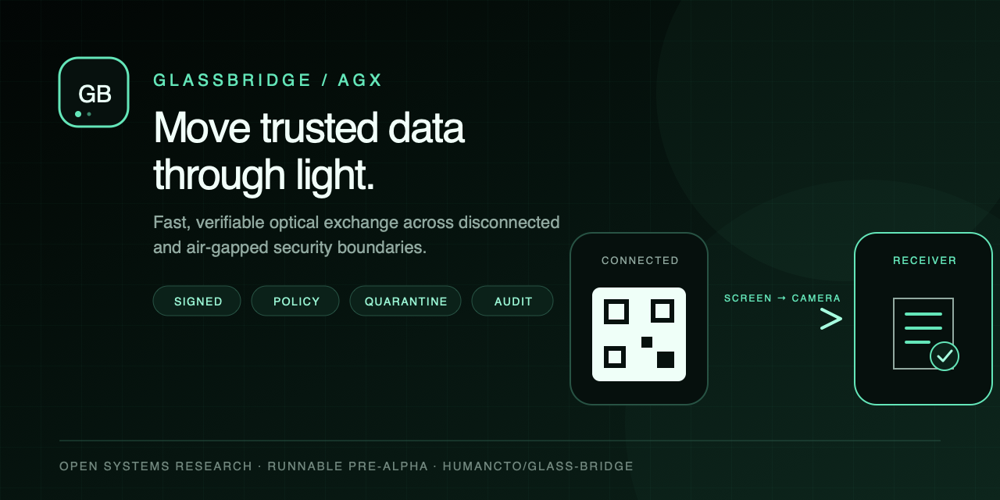

<p align="center">
  
</p>

<h1 align="center">GlassBridge / AGX</h1>

<p align="center"><strong>Move trusted data through light.</strong></p>

<p align="center">
  A runnable pre-alpha for verifiable optical file exchange across controlled, disconnected boundaries.
</p>

<p align="center">
  <a href="https://humancto.github.io/glass-bridge/send.html"><strong>Try the live sender</strong></a>
  ·
  <a href="https://humancto.github.io/glass-bridge/">Explore the research</a>
  ·
  <a href="docs/launch-article.md">Read the launch brief</a>
</p>

<p align="center">
  <a href="https://github.com/humancto/glass-bridge/actions/workflows/ci.yml"></a>
  <a href="https://github.com/humancto/glass-bridge/actions/workflows/pages.yml"></a>
  
  
  <a href="LICENSE"></a>
</p>

> [!WARNING]
> GlassBridge is a runnable research prototype, not a certified data diode, malware scanner, or production cross-domain solution. Open-source availability does not make the prototype suitable for production security enforcement.

## Try the browser flow

You need a laptop and a phone. The live path runs in two browsers and has no
application upload endpoint. The web applications are provisioned separately
over HTTPS; the demo does not make an ordinary phone an air-gapped or
receive-only device.

1. Open the [sender](https://humancto.github.io/glass-bridge/send.html) on the laptop.
2. Select **Load demo sample** or choose one file up to 256 KiB.
3. Scan the stationary pairing QR with the phone's normal Camera app.
4. Confirm the fingerprint, then tap **Trust sender & open camera**.
5. For the compatibility baseline, hold the phone landscape with both QR codes inside the guide, then start the stream on the laptop. For **Grid 30 lab**, turn the phone landscape first, then tap **Fullscreen & start** on the laptop once and keep all four colored corner markers visible. Escape exits fullscreen and pauses.
6. Review the verified object in quarantine, approve release, then save the file and signed receipt.

For a performance run, click **Load 144 KiB test payload**; this only queues the file. Select **Grid 30 lab**, then click **Prepare secure transfer**. Open the paired receiver and camera before pressing **Fullscreen & start**. Predeclare one exact laptop/phone pair and run three consecutive 30/s attempts without discarding warm-ups, failures, aborts, or timeouts; try 60/s only after all three verify. Changing the target rate intentionally requires re-pairing because pairing v4 binds the visual PHY and rate. Export the success or failure JSON after every attempt. Camera-open timing is diagnostic; publication comparisons require a synchronized sender optical-start marker.

## Why this project exists

Air-gapped systems still need firmware, configuration, certificates, datasets, and logs. Those crossings commonly rely on removable media plus procedure. GlassBridge explores a different primitive: make the crossing visible, ephemeral, authenticated, policy-constrained, quarantined, measurable, and auditable.

Animated QR, fountain coding, and fast optical transfer are prior art. GlassBridge's contribution is the security-boundary protocol around the transport:

- **AGX signed envelopes** bind exact bytes to a destination boundary, purpose, policy, sequence, and digest.
- **Receiver-local policy** decides what may cross; a valid sender signature is not enough.
- **Memory quarantine** keeps verified bytes unavailable until explicit human release.
- **Typed receipts** record what the receiver authorized without pretending emission proves delivery.
- **Codec independence** lets QR, dense grids, or future optical transports carry the same trust contract.
- **Verified goodput** measures files that survive reconstruction, cryptography, policy, and quarantine—not pixels flashed on a screen.

> QRFerry and Decimen move bytes through light. GlassBridge asks whether the receiving boundary can verify, constrain, quarantine, measure, approve, and receipt the crossing.

## The crossing

```mermaid
flowchart LR
    A["Connected sender"] --> B["Signed AGX envelope"]
    B --> C["Adaptive packing + fountain repair"]
    C -->|"screen → camera"| D["Bounded reconstruction"]
    D --> E["Signature + digest + boundary verification"]
    E --> F["Receiver-local policy"]
    F --> G["Memory quarantine"]
    G --> H["Human release"]
    H --> I["File + receiver-signed receipt"]
```



The strict one-way profile requires no acknowledgment or return signal. Pairing names the expected sender key, boundary, optical session, transport profile, and packing mode. Every optical frame is treated as hostile input.

## Speed without fiction

Instrumentation on the development setup points to screen-camera acquisition as the leading bottleneck hypothesis; repeated physical runs are still required to establish the bottleneck and measured benefit. The audit found concrete acquisition-path defects: the sender used fractional display scaling and fullscreened its entire control panel, while the receiver copied and globally re-registered a full camera raster on every exposure. Milestone 16 addresses those paths with Grid-only fullscreen at integer cell sizes, a valid acquisition preamble, registration reuse with bounded transport-valid reacquisition, bounded decode cadence, and separate camera-exposure, decode-job, transport-valid, duplicate, and rank-growth telemetry. It does not yet track the screen quadrilateral locally between global registration attempts.

| Profile | Useful payload | Nominal budget | Intended role |
| --- | ---: | ---: | ---: |
| Grid 30 lab · registered field | 2,032 B/symbol | 59.5 KiB/s at 30/s; 119.1 KiB/s at 60/s | robust post-QR experiment |
| Burst · dual QR v30-L | 1,688 B/code | 98.9 KiB/s at 60/s; 197.8 KiB/s at 120/s | compatibility baseline |
| Ceiling Lab · dual QR v40-L | 2,900 B/code | 169.9 KiB/s at 60/s; 339.8 KiB/s at 120/s | standard-QR ceiling experiment |

These are pre-loss channel budgets, not phone-camera results. Display refresh, camera exposure, rolling shutter, focus, moiré, and operator motion determine physical goodput. A higher selected code rate can be slower if it produces more rejected frames.

The [Decimen v0.4.0 README](https://github.com/bashalarmistalt/decimen-optical-transfer/blob/v0.4.0/README.md)
README reports 418.5 KB/s sustained and 601.5 KB/s peak for desktop-to-phone,
plus 199.2 KB/s sustained and 340.8 KB/s peak for phone-to-phone. Those are the
current public prior-art numbers, not GlassBridge results, and are not directly
comparable until the payload, device, setup, and timing window are aligned.
Grid v0's one-lane 60/s nominal ceiling is 119.1 KiB/s before loss, so matching
those results requires a different PHY, more independently recoverable visual
capacity, compression on suitable inputs, or some combination—not a scheduler
label.

The deterministic camera-raster gate projects the Grid through fractional perspective, bilinear resampling, moiré, brightness loss, colored distractors, and a high-fill blur probe. On the development Mac it reconstructed a 144 KiB payload from all 73 stable source epochs byte-for-byte with zero inner corrections and about 7.4 ms p95 decode; 72 mixed rolling-shutter epochs were rejected by transport CRC. The modeled Grid30 source floor is 2.43 seconds and the expected 102-frame LT window is 3.4 seconds. These are synthetic acquisition results—not phone-camera goodput. A structured 144 KiB CSV development sample packed to 23,907 optical bytes, while already-compressed or encrypted files usually remain on the identity path. Grid's first-accepted-to-last-accepted diagnostic can include its one-second symbol-zero acquisition preamble; it is intentionally not the publication timing window.

Read the complete methodology and stop rules in [Milestone 13](docs/milestone-13.md), [Milestone 14](docs/milestone-14.md), [Milestone 15](docs/milestone-15.md), [Milestone 16](docs/milestone-16.md), [AGX-PHY-GRID-0001](spec/AGX-PHY-GRID-0001.md), and [BENCH-0001](spec/BENCH-0001.md).

## What is implemented

- no-install browser sender and live phone receiver
- canonical CBOR AGX/1 envelope and COSE Sign1 Ed25519 signature
- SHA-256 payload verification and strict boundary binding
- session-bound AGF1/AGF2 frames with sparse LT repair
- dual-lane QR v30/v40 transports and 30/60/90/120-code test ladder
- registered full-screen binary Grid PHY with integer cell scaling, acquisition preamble, persistent four-corner recovery, whitening, interleaved Hamming correction, and exact frame CRC
- bounded adaptive gzip with pairing protocol v4 binding the packing mode, visual PHY, and target rate
- lane-parallel ZXing-C++ WASM decoding
- default-deny browser policy and in-memory quarantine
- replay reservation and receiver-signed release evidence
- schema-backed `glassbridge-capacity/5` success analytics and `glassbridge-device-run/1` failure diagnostics, including camera-open-to-verified diagnostics, first-valid latency, unique/duplicate rates, Grid lock quality, throttling, empty jobs, and comparisons matched by browser user agent, visual PHY, target rate, and exact payload; this is not a hardware identity guarantee
- Rust CLI, deterministic browser/Rust vectors, real PNG and H.264 loopbacks

Still research work: organizational trust roots, large-file transport, production FEC, adaptive feedback, protected monotonic replay state, encryption, malware scanning/CDR, native applications, dedicated receive-only hardware, and certification.

## Security model

| GlassBridge provides today | GlassBridge does not claim |
| --- | --- |
| Paired-session integrity and exact-byte verification | That an ephemeral demo key is an organizational identity |
| Receiver-local authorization before release | That signed content is safe content |
| Bounded parsers, reconstruction, and decompression | Immunity from browser, dependency, or media-parser defects |
| A no-ACK optical application profile | A certified hardware-enforced one-way device |
| Receiver-signed release evidence | Proof that another application persisted or used the file |
| An observable alternative to writable removable media | Confidentiality from cameras or observers without encryption and physical controls |

Read [SECURITY.md](SECURITY.md) before evaluating the system. Report vulnerabilities through [GitHub private vulnerability reporting](https://github.com/humancto/glass-bridge/security/advisories/new), not a public issue.

## Run it locally

Requirements: Node.js 22.13+ and Rust 1.91.1.

```bash
npm ci
npm run dev
```

Run the complete validation suite:

```bash
npm test
cargo fmt --all -- --check
cargo clippy --workspace --all-targets --all-features --locked -- -D warnings
cargo test --workspace --all-targets --all-features --locked
```

Run the deterministic trust-path demo:

```bash
cargo run --locked -p glassbridge-cli -- demo
```

Build the legacy CLI screen-demo fixture:

```bash
cargo run --locked -p glassbridge-cli -- screen-demo --output-dir work/phone-demo-run-001
open work/phone-demo-run-001/player.html
```

Pass a new empty `--output-dir` (for example, `work/phone-demo-run-001`) for each screen-demo run. On non-macOS systems, open the generated `player.html` in a browser instead of using `open`. The generated player and frame assets are local, but the live phone receiver is a separately provisioned HTTPS page unless you explicitly host it yourself; this command is not a self-contained high-assurance receiver or proof of an end-to-end air gap.

Useful performance commands:

```bash
npm run benchmark:capacity
npm run benchmark:parallel-decode
npm run benchmark:burst-decode
npm run benchmark:turbo-decode
npm run benchmark:grid
npm run benchmark:grid-acquisition
npm run benchmark:grid-recovery
```

## Repository map

```text
app/                         public research and product site
src/sender/                  browser sender and optical scheduler
src/receiver/                phone receiver, policy, quarantine, receipts
src/phy/                     visual-PHY encoders, registration and decoders
src/protocol/                shared browser transport and packing primitives
crates/agx-core/             bounded envelope, policy, workflow, transport
crates/agx-visual/           visual-codec boundary and QR baseline
crates/glassbridge-cli/      demos, fixtures, video and receipt tooling
spec/                        versioned protocol snapshots and CDDL
tests/                       browser, protocol, interoperability and flow gates
docs/                        milestone evidence, audits and launch material
research/                    self-contained GlassBridge / AGX PRD
```

## Read the design

- [Product definition, threat model, architecture, and prior art](https://humancto.github.io/glass-bridge/)
- [Self-contained GlassBridge / AGX PRD](research/GlassBridge_AGX_PRD.html)
- [Launch article](docs/launch-article.md)
- [Open-source readiness review](docs/open-source-readiness.md)
- [Browser security audit](docs/open-source-security-audit.md)
- [Successful-run JSON schema](spec/glassbridge-capacity-5.schema.json) and [failed-run JSON schema](spec/glassbridge-device-run-1.schema.json)
- [AGX envelope](spec/AGX-0001.md), [optical transport](spec/AGX-OT-0001.md), [policy](spec/POLICY-0001.md), [reception evidence](spec/RECEPTION-0001.md), and [browser receipts](spec/BROWSER-RECEIPT-0001.md)
- [Third-party notices and prior-art attribution](THIRD_PARTY_NOTICES.md) and the generated [dependency license inventory](THIRD_PARTY_LICENSES.md)

## Contributing and research results

The most valuable contribution today is reproducible evidence. Submit every repeated device run—including failures—using the physical-device result template. Protocol changes must state their compatibility and security consequences.

Before participating, read [CONTRIBUTING.md](CONTRIBUTING.md), [GOVERNANCE.md](GOVERNANCE.md), [CODE_OF_CONDUCT.md](CODE_OF_CONDUCT.md), and [SUPPORT.md](SUPPORT.md). Use [Discussions](https://github.com/humancto/glass-bridge/discussions) for questions and early ideas. Citation metadata is available in [CITATION.cff](CITATION.cff).

## Project status and license

GlassBridge is a public pre-alpha research preview. It is not ready for production security enforcement, and physical multi-device results remain the acceptance gate for performance claims.

Project-authored GlassBridge code and materials are licensed under the [Apache License 2.0](LICENSE). It permits use, modification, distribution, and commercial use subject to the license terms, including preservation of required notices. The copyright holders retain ownership; publishing under Apache-2.0 does not prevent commercial products, services, investment, or a future acquisition. Copyright permissions already granted for released versions are irrevocable, while Section 3 defines a patent-litigation termination condition. Bundled and adapted components retain their own licenses and notices in [THIRD_PARTY_NOTICES.md](THIRD_PARTY_NOTICES.md); the generated [dependency license inventory](THIRD_PARTY_LICENSES.md) is additional review evidence, not a legal opinion or a guarantee of completeness.
